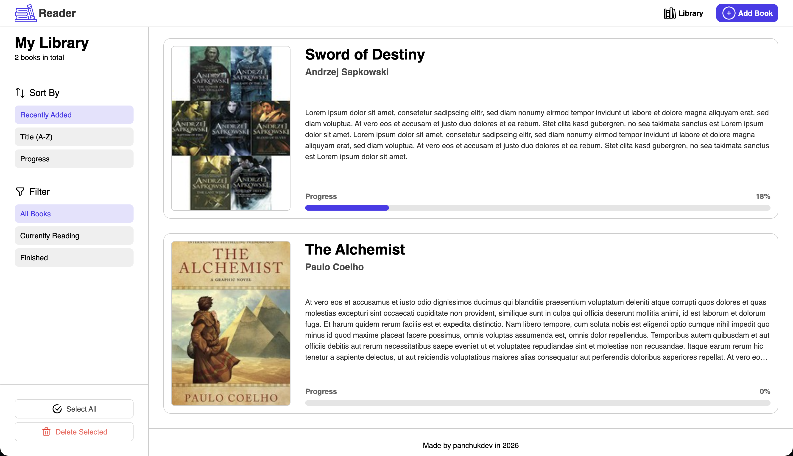
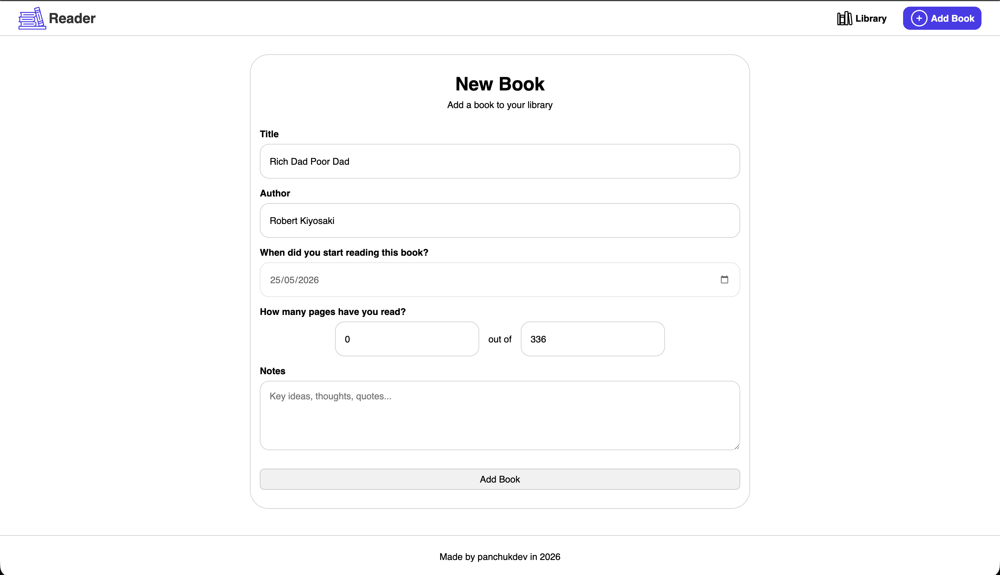
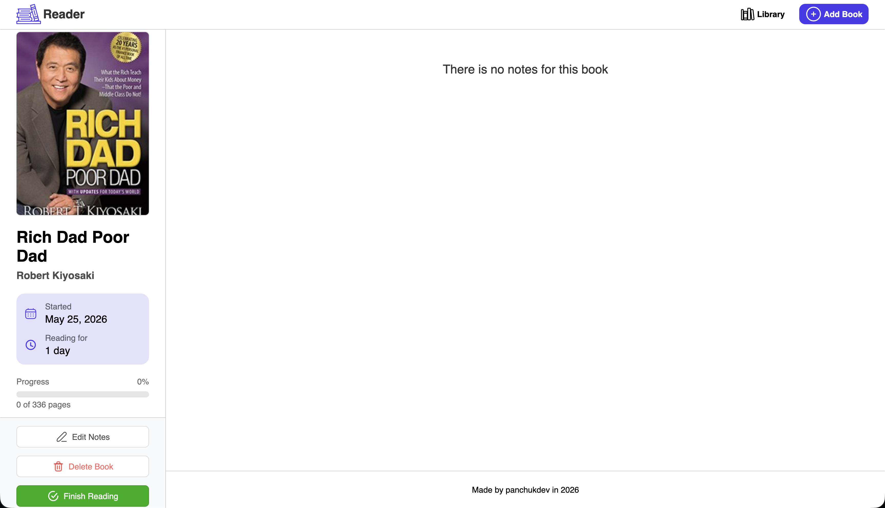
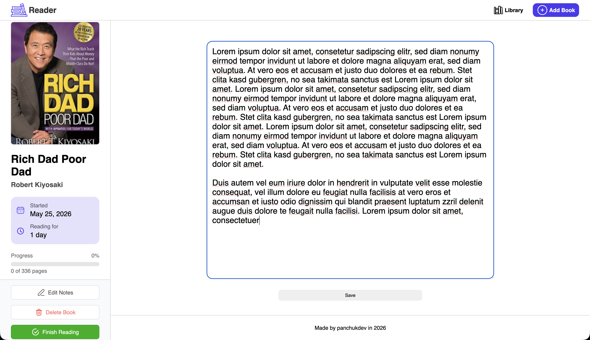
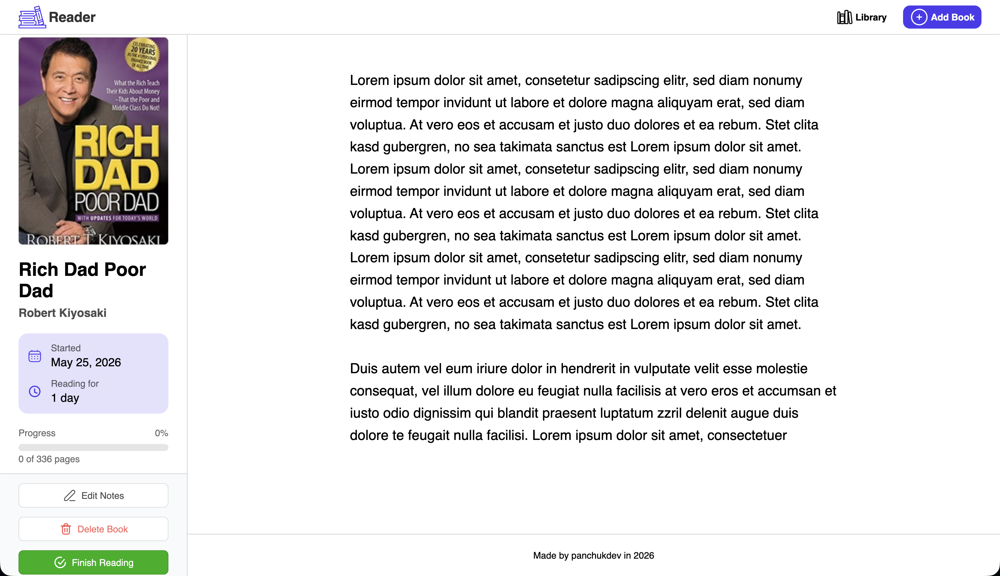
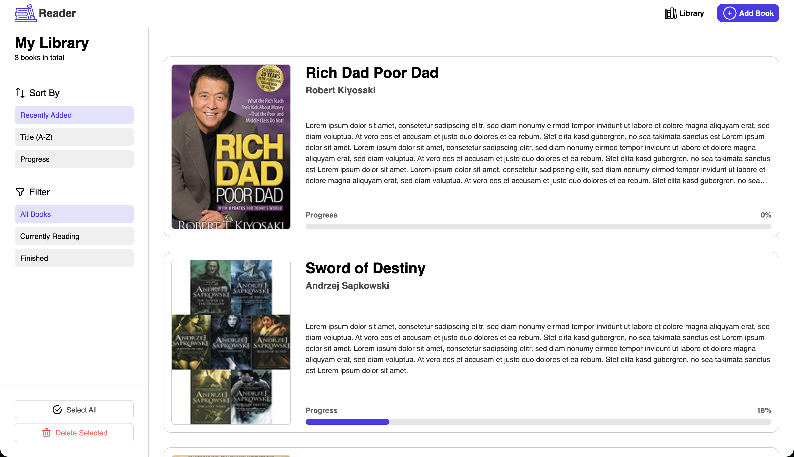

# 📚 Reader - Book Notes

A simple full-stack web app for tracking your reading progress, notes, and book library.  

Search books via OpenLibrary API, track pages, and visualize reading progress.


## Features

- 📖 Add books to your personal library
- 🔍 Auto-fetch book covers via OpenLibrary API
- 📝 Save personal notes for each book
- 📊 Track reading progress (pages & percentage)
- 📅 Start date tracking
- ⏱️ Reading duration calculation
- 🗂️ Filter books (reading / finished)
- 🔃 Sort books (recent, title, progress)
- 🗑️ Delete books


## Tech Stack

- **Backend:** Node.js, Express
- **Database:** PostgreSQL (pg)
- **Frontend:** EJS templates, HTML, CSS
- **HTTP Client:** Axios
- **API:** OpenLibrary API
- **Dev Tools:** Nodemon


## Installation

1. Clone the repository
```bash
  git clone https://github.com/panchukdev/reader-book-notes.git
  cd reader-book-notes
```

2. Install dependencies
```bash
npm install
```

3. Create a PostgreSQL database and run the following SQL:

```sql
CREATE TABLE books (
  id SERIAL PRIMARY KEY,
  title TEXT NOT NULL,
  author TEXT NOT NULL,
  notes TEXT,
  cover_id INTEGER,
  start_date DATE,
  pages INTEGER,
  read_pages INTEGER,
  finished BOOLEAN,
  date_added TIMESTAMPTZ DEFAULT now(),
  date_finished DATE
);
```
4. Configure database connection in index.js

```js
const db = new pg.Client({
  host: "",
  user: "",
  database: "",
  port: 5432,
  password: "",
});
```

5. Run the app

```bash
node index.js
```

6. Open in browser

http://localhost:3000

## 🚀 Usage

After starting the app, you can navigate through 3 main pages:

📚 Library (Home page)

This is your main dashboard where all books are displayed.

Features:

* View all added books
* Sort books:
    * By title
    * By reading progress
    * By recently added
* Filter books:
    * All books
    * Currently reading
    * Finished
* See progress bar for each book
* Quick access to book details

___

➕ Add Book

A form page where you can add a new book to your library.

What happens when you add a book:

* Book is saved to PostgreSQL database
* Cover image is automatically fetched from OpenLibrary API (if available)
* Reading progress fields are initialized

Fields:

* Title
* Author
* Start date
* Pages / Read pages
* Notes (optional)

___

📖 Book Page (Details)

This is the individual book view.

Features:

* Full book information (title, author, cover)
* Reading progress percentage
* Start date + reading duration (in days)
* Notes system:
    * Add notes
    * Edit notes inline
* Mark book as finished
* Delete book
## Screenshots






